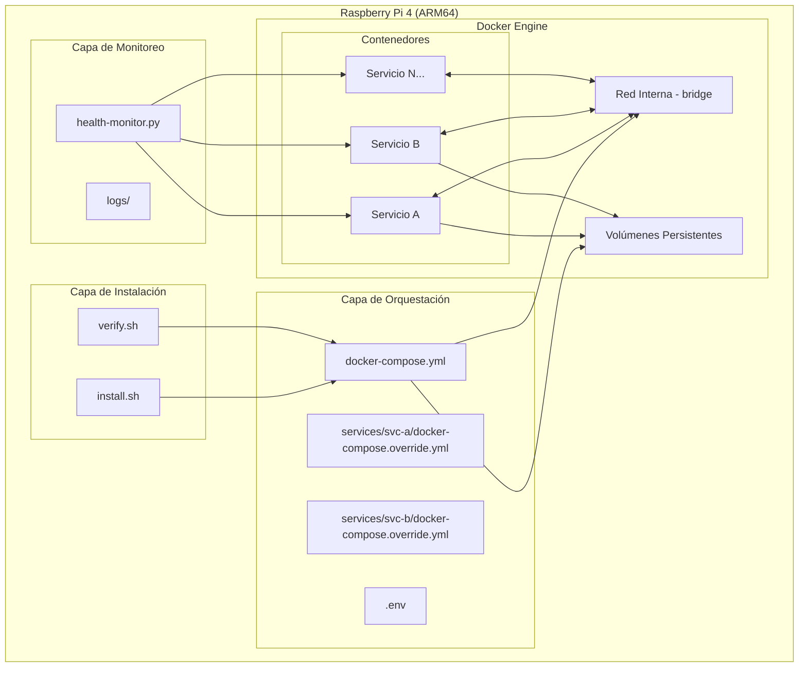
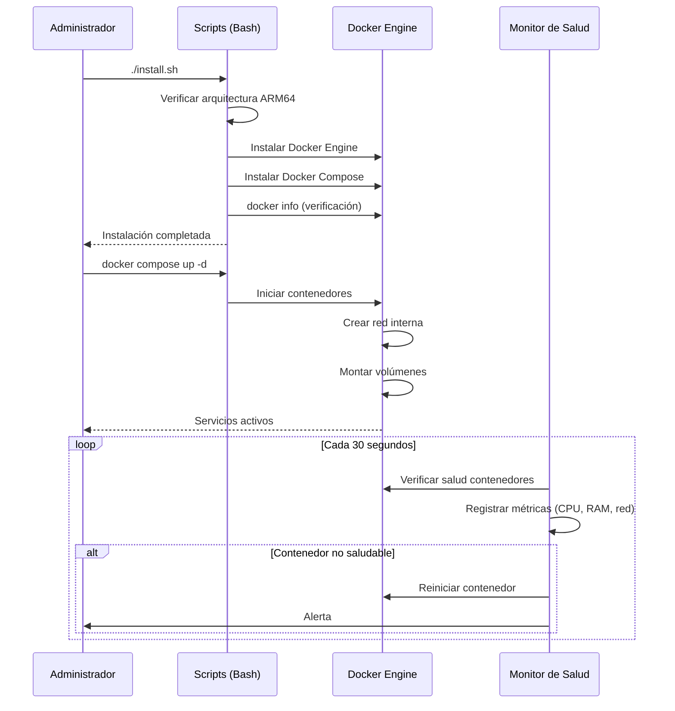
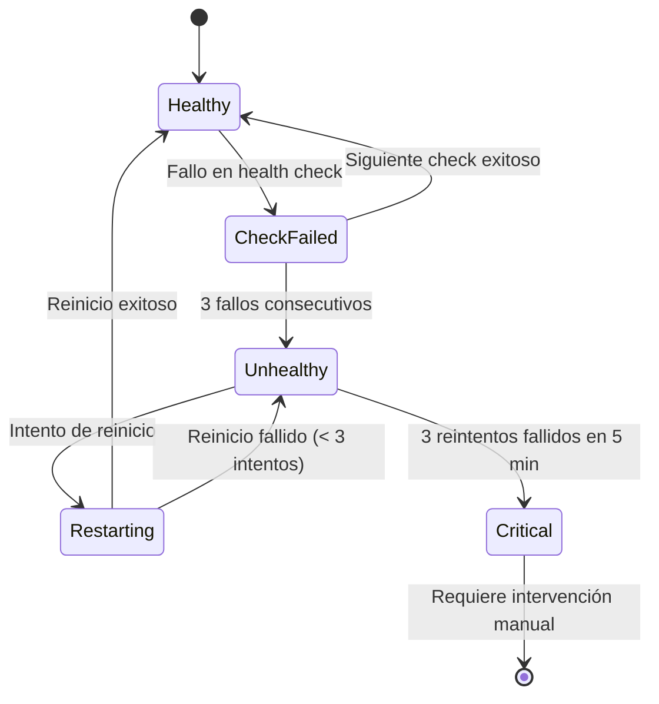

# Documento de Diseño: rpi4-docker-infra

## Overview

Este documento describe el diseño técnico para la infraestructura Docker en una Raspberry Pi 4 (ARM64). El sistema consiste en scripts de instalación y configuración, un monitor de salud, y una estructura modular de Docker Compose que permite gestionar múltiples proyectos como contenedores aislados.

La arquitectura se basa en tres capas principales:
1. **Capa de instalación**: Scripts Bash que instalan y verifican Docker Engine y Docker Compose
2. **Capa de orquestación**: Archivos Docker Compose con estructura modular multi-proyecto
3. **Capa de monitoreo**: Un servicio de monitoreo que verifica la salud de los contenedores y los recursos del sistema

### Decisiones de Diseño Clave

| Decisión | Elección | Justificación |
|----------|----------|---------------|
| Lenguaje de scripts | Bash | Disponible nativamente en Raspberry Pi OS, sin dependencias adicionales |
| Monitoreo | Script Python ligero | Menor consumo de recursos que soluciones como Prometheus/Grafana para un servidor doméstico |
| Estructura Compose | Archivos override por servicio | Permite agregar/eliminar servicios sin modificar el archivo principal |
| Almacenamiento de logs | Archivos locales con rotación | Apropiado para servidor doméstico sin infraestructura de logging externa |

## Architecture



### Flujo de Operación



## Components and Interfaces

### 1. Script de Instalación (`install.sh`)

**Responsabilidad**: Instalar Docker Engine y Docker Compose en la Raspberry Pi 4.

**Interfaz**:
```bash
# Entrada: ninguna (detecta el sistema automáticamente)
# Salida: código de salida 0 (éxito) o distinto de 0 (error)
# Efectos: instala Docker Engine + Docker Compose, habilita systemd
./install.sh
```

**Comportamiento**:
- Verifica arquitectura (`uname -m` == `aarch64`)
- Verifica sistema operativo de 64 bits
- Instala Docker Engine desde repositorio oficial
- Instala Docker Compose (plugin v2)
- Habilita Docker en systemd (`systemctl enable docker`)
- Ejecuta verificación post-instalación

### 2. Script de Verificación (`verify.sh`)

**Responsabilidad**: Verificar que Docker Engine y Docker Compose están correctamente instalados y operativos.

**Interfaz**:
```bash
# Entrada: ninguna
# Salida: código de salida 0 (éxito) o distinto de 0 (error)
# Efectos: ninguno (solo lectura)
./verify.sh
```

**Comportamiento**:
- Ejecuta `docker info` con timeout de 30 segundos
- Ejecuta `docker compose version` con timeout de 10 segundos
- Verifica versión mínima de Docker Compose (>= 2.20.0)
- Reporta resultados en stdout

### 3. Gestor de Contenedores (`manage.sh`)

**Responsabilidad**: Proporcionar comandos simplificados para gestionar contenedores.

**Interfaz**:
```bash
./manage.sh start              # Iniciar todos los servicios
./manage.sh stop               # Detener todos los servicios
./manage.sh restart <servicio> # Reiniciar un servicio específico
./manage.sh status             # Mostrar estado de contenedores
./manage.sh validate           # Validar configuración
./manage.sh logs <servicio>    # Mostrar logs de un servicio
```

**Comportamiento**:
- `start`: Ejecuta `docker compose up -d` con timeout de 60s por contenedor
- `stop`: Ejecuta `docker compose down` con SIGTERM + 10s grace period
- `restart`: Valida nombre de servicio, reinicia solo ese contenedor
- `status`: Muestra tabla con nombre, estado, puertos, uptime
- `validate`: Verifica sintaxis de todos los archivos de configuración
- `logs`: Muestra últimas 50 líneas del contenedor indicado

### 4. Monitor de Salud (`health-monitor.py`)

**Responsabilidad**: Verificar periódicamente el estado de los contenedores y generar alertas.

**Interfaz**:
```python
class HealthMonitor:
    def __init__(self, config: MonitorConfig):
        """Inicializa el monitor con la configuración dada."""

    def check_container_health(self, container_id: str) -> HealthStatus:
        """Verifica la salud de un contenedor específico."""

    def check_resource_usage(self, container_id: str) -> ResourceMetrics:
        """Obtiene métricas de uso de recursos de un contenedor."""

    def evaluate_alerts(self, metrics: ResourceMetrics, container_name: str) -> list[Alert]:
        """Evalúa si las métricas superan los umbrales configurados."""

    def handle_unhealthy(self, container_id: str, container_name: str) -> RestartResult:
        """Gestiona un contenedor no saludable (reinicio con reintentos)."""

    def run(self):
        """Bucle principal de monitoreo (cada 30 segundos)."""
```

**Máquina de estados del contenedor**:


### 5. Validador de Configuración (`config_validator.py`)

**Responsabilidad**: Validar la sintaxis y semántica de los archivos de configuración antes de aplicar cambios.

**Interfaz**:
```python
class ConfigValidator:
    def validate_compose_file(self, file_path: str) -> ValidationResult:
        """Valida un archivo docker-compose.yml."""

    def validate_env_file(self, file_path: str) -> ValidationResult:
        """Valida un archivo .env."""

    def validate_service_config(self, service_name: str) -> ValidationResult:
        """Valida la configuración completa de un servicio."""

    def check_security_compliance(self, compose_config: dict) -> list[SecurityWarning]:
        """Verifica cumplimiento de políticas de seguridad."""
```

### 6. Monitor de Disco (`disk_monitor.py`)

**Responsabilidad**: Verificar el espacio disponible en disco y notificar cuando sea bajo.

**Interfaz**:
```python
class DiskMonitor:
    def check_disk_space(self, volume_path: str) -> DiskStatus:
        """Verifica el espacio disponible en la ruta de volúmenes."""

    def should_notify(self, last_notification_time: datetime) -> bool:
        """Determina si debe emitir una notificación (máx 1 cada 10 min)."""
```

## Data Models

### Estructura de Directorios del Proyecto

```
raspberry/
├── install.sh                    # Script de instalación
├── verify.sh                     # Script de verificación
├── manage.sh                     # Script de gestión
├── docker-compose.yml            # Archivo principal de composición
├── .env                          # Variables de entorno (secretos)
├── .env.example                  # Ejemplo de variables de entorno
├── .gitignore                    # Excluye .env y logs
├── services/                     # Directorio de servicios modulares
│   ├── service-template/         # Plantilla para nuevos servicios
│   │   └── docker-compose.override.yml
│   ├── service-a/
│   │   └── docker-compose.override.yml
│   └── service-b/
│       └── docker-compose.override.yml
├── volumes/                      # Datos persistentes (configurable)
│   ├── service-a/
│   └── service-b/
├── monitor/                      # Componentes de monitoreo
│   ├── health-monitor.py
│   ├── config_validator.py
│   ├── disk_monitor.py
│   ├── config.yml                # Configuración del monitor
│   └── requirements.txt
└── logs/                         # Logs del monitor
    └── health.log
```

### Modelos de Configuración

```python
from dataclasses import dataclass
from datetime import datetime
from enum import Enum
from typing import Optional


class ContainerState(Enum):
    HEALTHY = "healthy"
    CHECK_FAILED = "check_failed"
    UNHEALTHY = "unhealthy"
    RESTARTING = "restarting"
    CRITICAL = "critical"


@dataclass
class MonitorConfig:
    check_interval_seconds: int = 30          # Intervalo entre verificaciones
    health_check_timeout_seconds: int = 5     # Timeout por intento
    max_consecutive_failures: int = 3         # Fallos antes de marcar unhealthy
    max_restart_attempts: int = 3             # Reintentos máximos
    restart_window_minutes: int = 5           # Ventana de tiempo para reintentos
    memory_alert_threshold_percent: float = 85.0
    cpu_alert_threshold_percent: float = 90.0
    cpu_alert_consecutive_cycles: int = 3
    docker_reconnect_interval_seconds: int = 60
    docker_max_reconnect_attempts: int = 10
    disk_check_interval_seconds: int = 60
    disk_low_threshold_percent: float = 10.0
    disk_notification_cooldown_minutes: int = 10


@dataclass
class ResourceMetrics:
    container_name: str
    cpu_percent: float
    memory_percent: float
    memory_usage_mb: float
    memory_limit_mb: float
    network_rx_bytes: int
    network_tx_bytes: int
    timestamp: datetime


@dataclass
class HealthStatus:
    container_id: str
    container_name: str
    state: ContainerState
    consecutive_failures: int
    restart_attempts: int
    last_check: datetime
    last_state_change: datetime


@dataclass
class Alert:
    level: str  # "warning" | "critical"
    container_name: str
    message: str
    timestamp: datetime
    metric_value: Optional[float] = None
    threshold: Optional[float] = None


@dataclass
class ValidationResult:
    valid: bool
    errors: list[str]
    warnings: list[str]
    file_path: str
    line_number: Optional[int] = None


@dataclass
class DiskStatus:
    path: str
    total_mb: float
    used_mb: float
    available_mb: float
    usage_percent: float
    is_low: bool


@dataclass
class RestartResult:
    success: bool
    container_name: str
    attempt_number: int
    error_message: Optional[str] = None


@dataclass
class ServiceSecurityConfig:
    user_non_root: bool = True
    no_new_privileges: bool = True
    cpu_limit: str = "1.0"          # Núcleos de CPU
    memory_limit: str = "512m"      # Memoria RAM
    restart_policy_max_retries: int = 5
    bind_localhost_only: bool = True
    image_version_pinned: bool = True
    root_exception_justification: Optional[str] = None
```

### Archivo Docker Compose Principal (`docker-compose.yml`)

```yaml
# docker-compose.yml - Archivo principal de infraestructura
# Este archivo define la red interna y configuración base.
# Los servicios individuales se definen en services/<nombre>/docker-compose.override.yml

networks:
  internal:
    driver: bridge
    name: rpi4_internal

# Los volúmenes se definen por servicio en sus archivos override
# La ruta base se configura en .env con VOLUMES_PATH

# Para agregar un nuevo servicio:
# 1. Crear directorio services/<nombre>/
# 2. Crear docker-compose.override.yml en ese directorio
# 3. Ejecutar: ./manage.sh validate
# 4. Ejecutar: ./manage.sh start
```

### Archivo de Ejemplo de Servicio (`services/service-template/docker-compose.override.yml`)

```yaml
# Plantilla para agregar un nuevo servicio
# Copiar este directorio y renombrar según el servicio

services:
  # Nombre del servicio (usado como DNS interno)
  mi-servicio:
    # Imagen Docker (SIEMPRE fijar versión específica)
    image: nombre-imagen:version-especifica
    
    # Usuario no-root (obligatorio salvo excepción documentada)
    user: "1000:1000"
    
    # Conectar a la red interna
    networks:
      - internal
    
    # Puertos expuestos (vincular a localhost por defecto)
    ports:
      - "127.0.0.1:8080:8080"
    
    # Volumen persistente
    volumes:
      - ${VOLUMES_PATH:-./volumes}/mi-servicio:/data
    
    # Límites de recursos
    deploy:
      resources:
        limits:
          cpus: "1.0"
          memory: 512M
    
    # Seguridad
    security_opt:
      - no-new-privileges:true
    
    # Política de reinicio
    restart: on-failure:5
    
    # Health check
    healthcheck:
      test: ["CMD", "curl", "-f", "http://localhost:8080/health"]
      interval: 30s
      timeout: 5s
      retries: 3
      start_period: 10s
    
    # Variables de entorno desde archivo .env
    env_file:
      - ../../.env

networks:
  internal:
    external: true
    name: rpi4_internal
```

### Configuración del Monitor (`monitor/config.yml`)

```yaml
# Configuración del monitor de salud
monitor:
  check_interval: 30        # segundos
  health_check_timeout: 5   # segundos
  max_failures: 3           # fallos consecutivos antes de unhealthy
  max_restarts: 3           # reintentos máximos
  restart_window: 300       # segundos (5 minutos)

alerts:
  memory_threshold: 85      # porcentaje
  cpu_threshold: 90         # porcentaje
  cpu_consecutive_cycles: 3
  disk_low_threshold: 10    # porcentaje

docker:
  reconnect_interval: 60    # segundos
  max_reconnect_attempts: 10

disk:
  check_interval: 60        # segundos
  notification_cooldown: 600 # segundos (10 minutos)

logging:
  file: ../logs/health.log
  max_size_mb: 10
  backup_count: 3
```


## Correctness Properties

*Una propiedad es una característica o comportamiento que debe mantenerse verdadero en todas las ejecuciones válidas de un sistema — esencialmente, una declaración formal sobre lo que el sistema debe hacer. Las propiedades sirven como puente entre especificaciones legibles por humanos y garantías de corrección verificables por máquinas.*

### Property 1: Comparación de versiones

*Para cualquier* par de cadenas de versión semántica válidas (X.Y.Z), la función de comparación de versiones SHALL determinar correctamente si una versión es inferior, igual o superior a otra, respetando el orden semántico (mayor > menor > parche).

**Validates: Requirements 2.3**

### Property 2: Orden de dependencias (inicio y detención)

*Para cualquier* grafo acíclico dirigido de dependencias entre servicios, el orden de inicio SHALL ser un ordenamiento topológico válido (cada servicio se inicia después de todas sus dependencias), y el orden de detención SHALL ser el inverso exacto del orden de inicio.

**Validates: Requirements 3.1, 3.2**

### Property 3: Completitud del estado de contenedores

*Para cualquier* conjunto de metadatos de contenedores (con nombre, estado, puertos y tiempo de actividad arbitrarios), la función de visualización de estado SHALL incluir todos los campos requeridos (nombre, estado, puertos expuestos, tiempo de actividad) en la salida formateada.

**Validates: Requirements 3.4**

### Property 4: Error de servicio inexistente

*Para cualquier* nombre de servicio que no existe en la configuración y cualquier lista de servicios válidos, el mensaje de error SHALL contener el nombre del servicio solicitado y SHALL listar todos los nombres de servicios válidos disponibles.

**Validates: Requirements 3.6**

### Property 5: Validación de ruta de volúmenes

*Para cualquier* ruta del sistema de archivos, la función de validación SHALL rechazar rutas que no existen o que no tienen permisos de lectura y escritura, generando un mensaje de error que indica la ruta inválida y el permiso faltante específico.

**Validates: Requirements 5.4**

### Property 6: Completitud de información de volúmenes

*Para cualquier* conjunto de metadatos de volúmenes (con nombre, tamaño y contenedor asociado arbitrarios), la función de visualización SHALL incluir el nombre, tamaño en megabytes y contenedor asociado de cada volumen en la salida.

**Validates: Requirements 5.5**

### Property 7: Umbral de disco y cooldown de notificaciones

*Para cualquier* secuencia de lecturas de espacio en disco con marcas de tiempo, el sistema SHALL generar una alerta cuando el espacio disponible es inferior al 10% de la capacidad total, y SHALL emitir como máximo una notificación cada 10 minutos mientras la condición persista.

**Validates: Requirements 5.6**

### Property 8: Máquina de estados del monitor de salud

*Para cualquier* secuencia de resultados de verificación de salud (éxito/fallo) y resultados de reinicio (éxito/fallo) con marcas de tiempo, las transiciones de estado SHALL seguir las reglas: 3 fallos consecutivos → no saludable, reinicio automático con máximo 3 intentos en 5 minutos, y 3 reintentos fallidos en 5 minutos → estado crítico con cese de reintentos.

**Validates: Requirements 6.2, 6.3, 6.4**

### Property 9: Alerta de umbral de memoria

*Para cualquier* valor de uso de memoria y límite asignado, el sistema SHALL generar una alerta si y solo si el uso supera el 85% del límite, incluyendo el nombre del contenedor y el porcentaje de uso actual.

**Validates: Requirements 6.6**

### Property 10: Alerta de CPU por ciclos consecutivos

*Para cualquier* secuencia de mediciones de uso de CPU, el sistema SHALL generar una alerta si y solo si 3 mediciones consecutivas superan el 90%, incluyendo el nombre del contenedor y el porcentaje de uso promedio de los 3 ciclos.

**Validates: Requirements 6.7**

### Property 11: Máquina de estados de reconexión a Docker

*Para cualquier* secuencia de intentos de conexión a Docker Engine (éxito/fallo), el sistema SHALL reintentar cada 60 segundos hasta un máximo de 10 intentos, y SHALL generar una alerta con la duración de la desconexión si se agotan los 10 intentos.

**Validates: Requirements 6.8, 6.9**

### Property 12: Cumplimiento de seguridad en configuración

*Para cualquier* configuración de servicio Docker, la función de validación de seguridad SHALL verificar que: (a) el usuario es no-root (UID ≠ 0) a menos que exista una justificación documentada, (b) no-new-privileges está habilitado, (c) los puertos están vinculados a 127.0.0.1 salvo configuración explícita contraria, y (d) la política de reinicio tiene máximo 5 reintentos.

**Validates: Requirements 7.1, 7.3, 7.4, 7.5, 7.8**

### Property 13: Resolución de límites de recursos

*Para cualquier* configuración de servicio, el sistema SHALL aplicar los límites de CPU y memoria definidos explícitamente, y SHALL aplicar los valores por defecto (1 CPU, 512MB) cuando no se definen límites explícitos.

**Validates: Requirements 7.2, 7.9**

### Property 14: Validación de etiqueta de imagen

*Para cualquier* cadena de referencia de imagen Docker, la función de validación SHALL generar una advertencia si y solo si la imagen usa la etiqueta "latest" o no tiene etiqueta de versión específica.

**Validates: Requirements 7.6**

### Property 15: Validación de configuración con reporte de errores

*Para cualquier* contenido de archivo de configuración (YAML válido e inválido), el validador SHALL identificar correctamente errores de sintaxis y SHALL reportar el archivo y la línea donde se encuentra cada error. Para configuraciones válidas, SHALL retornar un resultado sin errores.

**Validates: Requirements 8.5, 8.6**

## Error Handling

### Estrategia General

El sistema utiliza un enfoque de "fail fast" donde los errores se detectan lo antes posible y se reportan de forma clara al Administrador.

### Categorías de Error

| Categoría | Comportamiento | Ejemplo |
|-----------|---------------|---------|
| Error fatal de instalación | Terminar con código ≠ 0, mensaje descriptivo | Arquitectura no soportada |
| Error de prerequisito | Terminar con código ≠ 0, indicar dependencia | Docker Engine no instalado |
| Error de configuración | Rechazar cambios, mostrar archivo y línea | YAML inválido |
| Error de contenedor | Registrar error, mostrar últimos 50 logs | Contenedor no inicia |
| Error de monitoreo | Registrar, reintentar con backoff | Conexión a Docker perdida |
| Advertencia | Registrar en logs, continuar ejecución | Imagen sin versión fija |

### Códigos de Salida

```
0  - Éxito
1  - Error general
2  - Error de prerequisitos (arquitectura, OS, Docker no instalado)
3  - Error de configuración (YAML inválido, ruta inválida)
4  - Error de ejecución (contenedor no inicia, timeout)
5  - Error de red (descarga fallida, DNS no resuelve)
```

### Formato de Mensajes de Error

```
[ERROR] <timestamp> - <componente>: <descripción del error>
[WARN]  <timestamp> - <componente>: <descripción de advertencia>
[INFO]  <timestamp> - <componente>: <mensaje informativo>
```

### Manejo de Errores por Componente

**Scripts de Instalación (`install.sh`, `verify.sh`)**:
- Verificar prerequisitos antes de cualquier acción
- Usar `set -euo pipefail` para detener en primer error
- Capturar señales para limpieza en caso de interrupción
- Sugerir acciones correctivas en cada mensaje de error

**Monitor de Salud (`health-monitor.py`)**:
- Excepciones de conexión a Docker: reintentar con límite
- Excepciones de contenedor individual: registrar y continuar con otros
- Excepciones no esperadas: registrar stack trace completo, continuar bucle principal

**Validador de Configuración (`config_validator.py`)**:
- Errores de parsing YAML: reportar línea y columna
- Errores semánticos (servicio referencia red inexistente): reportar contexto
- Múltiples errores: reportar todos antes de terminar (no detenerse en el primero)

## Testing Strategy

### Enfoque Dual

La estrategia de testing combina:
1. **Tests unitarios**: Verifican ejemplos específicos, casos borde y condiciones de error
2. **Tests basados en propiedades (PBT)**: Verifican propiedades universales con entradas generadas aleatoriamente
3. **Tests de integración**: Verifican el comportamiento del sistema completo con Docker real

### Framework y Herramientas

| Tipo | Herramienta | Justificación |
|------|-------------|---------------|
| Unit tests | pytest | Estándar para Python, buena integración con PBT |
| Property tests | Hypothesis | Librería PBT madura para Python, excelente generación de datos |
| Shell tests | bats-core | Framework de testing para scripts Bash |
| Integration tests | pytest + docker SDK | Permite controlar Docker programáticamente |

### Configuración de Tests Basados en Propiedades

- **Librería**: Hypothesis (Python)
- **Iteraciones mínimas**: 100 por propiedad
- **Etiquetado**: Cada test referencia su propiedad del documento de diseño
- **Formato de etiqueta**: `Feature: rpi4-docker-infra, Property {número}: {texto}`

### Tests Unitarios (Ejemplos y Casos Borde)

| Criterio | Tipo | Descripción |
|----------|------|-------------|
| 1.4 | EXAMPLE | Error de instalación genera mensaje descriptivo |
| 1.5 | EXAMPLE | Arquitectura no ARM64 produce error con requisitos |
| 2.4 | EXAMPLE | Fallo por red/permisos muestra causa específica |
| 2.5 | EXAMPLE | Docker Engine ausente produce error de prerequisito |
| 3.5 | EXAMPLE | Contenedor fallido muestra últimos 50 logs |
| 4.5 | EXAMPLE | Fallo DNS registra error con nombres de origen/destino |
| 5.3 | EXAMPLE | Variable VOLUMES_PATH configura ruta correctamente |

### Tests de Integración

| Criterio | Descripción |
|----------|-------------|
| 3.3 | Reinicio de servicio no afecta otros contenedores |
| 4.2-4.4 | Resolución DNS y aislamiento de red |
| 5.2 | Datos persisten entre reinicios de contenedor |
| 8.2-8.3 | Agregar/eliminar servicios sin afectar existentes |

### Tests Smoke

| Criterio | Descripción |
|----------|-------------|
| 1.1-1.3 | Docker Engine instalado y habilitado en systemd |
| 2.1-2.2 | Docker Compose instalado con versión correcta |
| 4.1 | Red interna creada |
| 7.7 | .gitignore excluye .env |
| 8.1, 8.4 | Estructura de directorios y plantilla con comentarios |

### Estructura de Tests

```
tests/
├── unit/
│   ├── test_version_compare.py
│   ├── test_dependency_order.py
│   ├── test_status_display.py
│   ├── test_path_validation.py
│   ├── test_disk_monitor.py
│   ├── test_health_state_machine.py
│   ├── test_resource_alerts.py
│   ├── test_reconnection.py
│   ├── test_security_compliance.py
│   ├── test_resource_limits.py
│   ├── test_image_tag_validation.py
│   └── test_config_validator.py
├── property/
│   ├── test_prop_version_compare.py
│   ├── test_prop_dependency_order.py
│   ├── test_prop_display_functions.py
│   ├── test_prop_path_validation.py
│   ├── test_prop_disk_monitor.py
│   ├── test_prop_health_monitor.py
│   ├── test_prop_resource_alerts.py
│   ├── test_prop_reconnection.py
│   ├── test_prop_security.py
│   ├── test_prop_resource_limits.py
│   ├── test_prop_image_tags.py
│   └── test_prop_config_validator.py
├── integration/
│   ├── test_container_lifecycle.py
│   ├── test_networking.py
│   ├── test_volumes.py
│   └── test_multi_project.py
├── smoke/
│   ├── test_installation.bats
│   └── test_structure.bats
└── conftest.py
```
